# Assignment 1 - Automated EC2 Instance Management

## Objective

Automatically stop EC2 instances tagged `Auto-Stop` and start instances tagged `Auto-Start` using AWS Lambda and Boto3.

## Steps Followed

1. Create two EC2 instances:
    - One tagged with `Action: Auto-Start`
    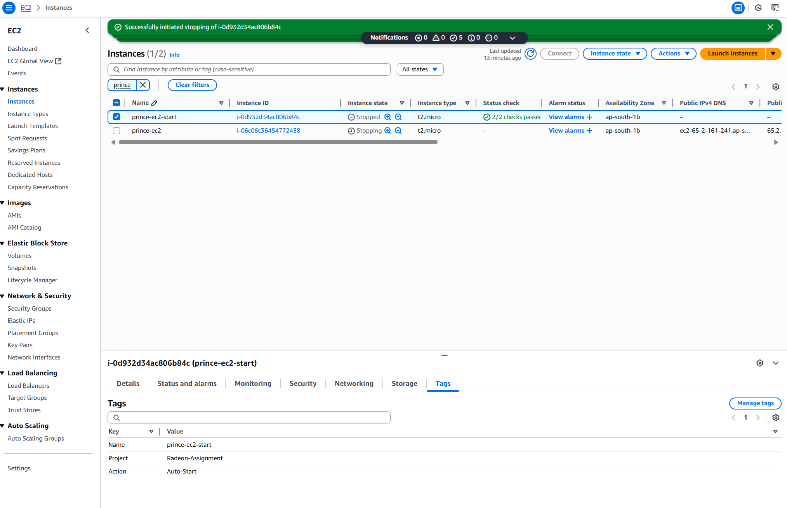

    - One tagged with `Action: Auto-Stop`
    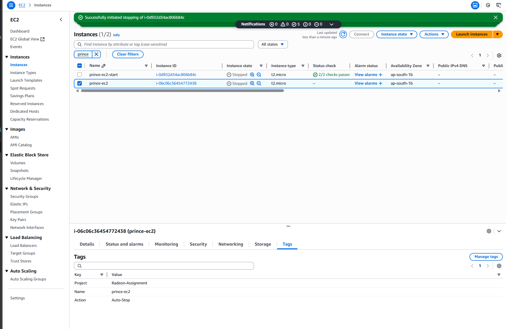

2. Create an IAM role `prince-lamda-role-task-1` with `AmazonEC2FullAccess`.
    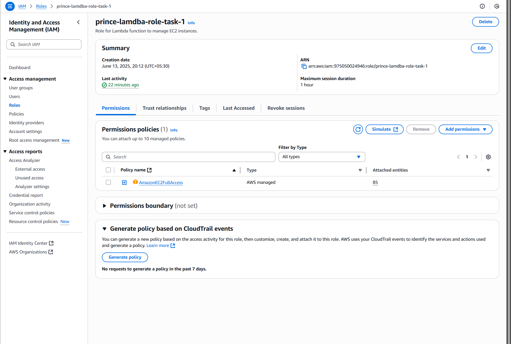

3. Create Lambda function (in this case its) `prince-lambda` with Python 3.13.
    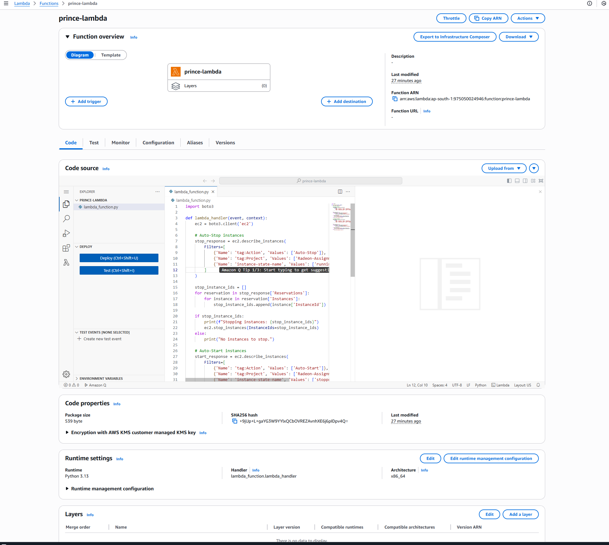

4. Lambda function uses Boto3 to:
    - Stop running instances tagged `Auto-Stop`.
    - Start stopped instances tagged `Auto-Start`.
    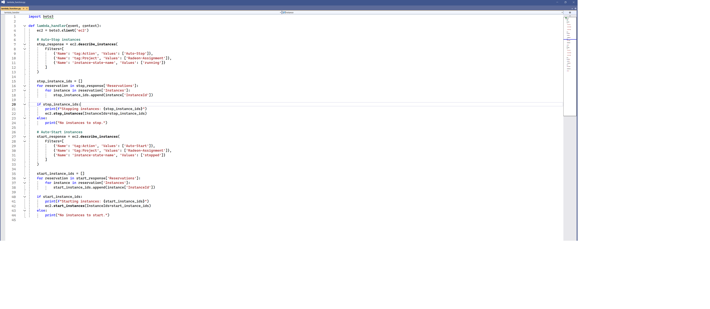

5. Manually invoked the Lambda function and verified EC2 instance state changes.
    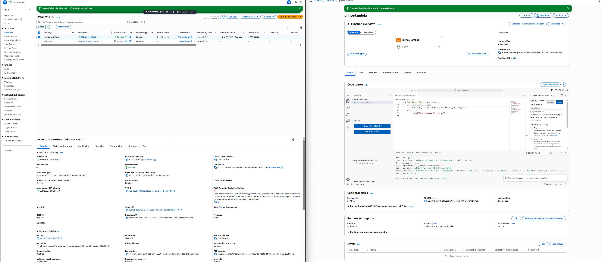

______________________________________________
# Assignment 2 - Automated EC2 Instance Management

## Objective

Automatically delete files older than 30 days in a specific S3 bucket using AWS Lambda and Boto3.

## Steps Followed

1. Created S3 bucket `radeon-s3-cleanup-assignment`.
   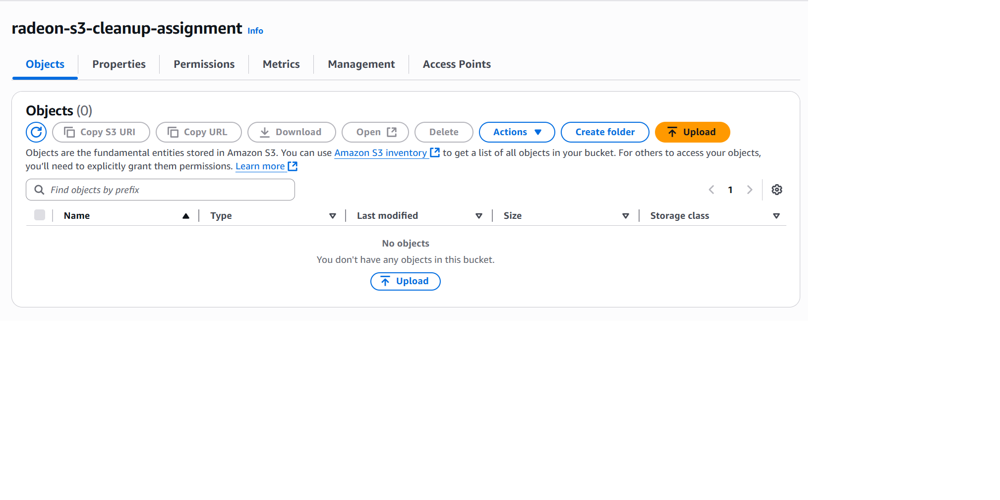

2. Uploaded test files (some new, some old).
   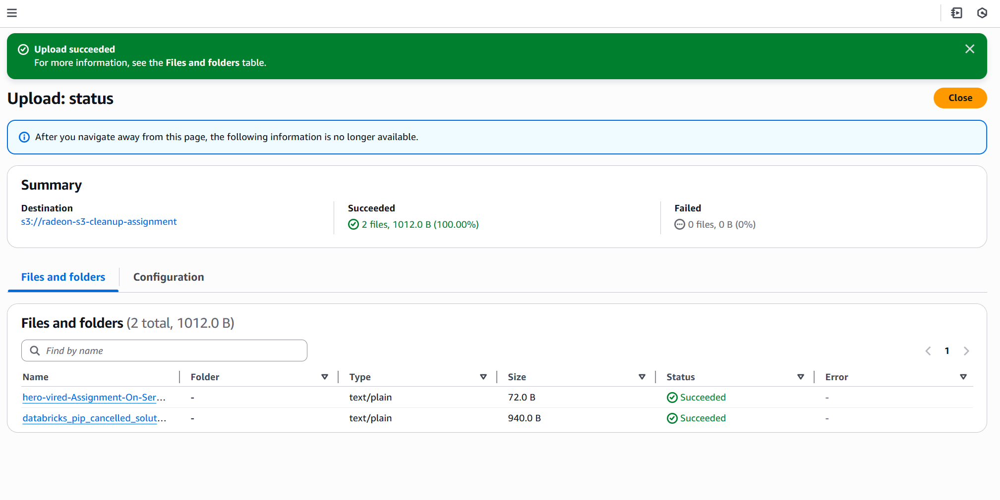

3. Create an IAM role `prince-lamda-role-task-1` with `AmazonS3FullAccess`.
   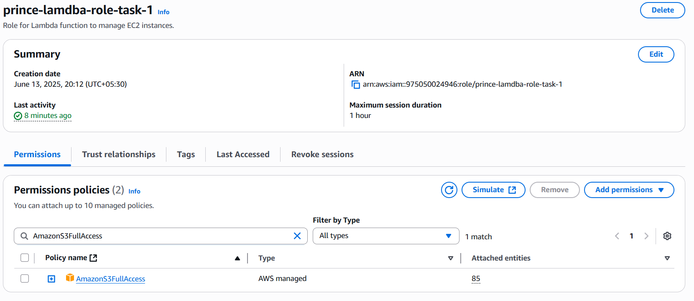

4. Create Lambda function (in this case its) `prince-lambda` with Python 3.13.
   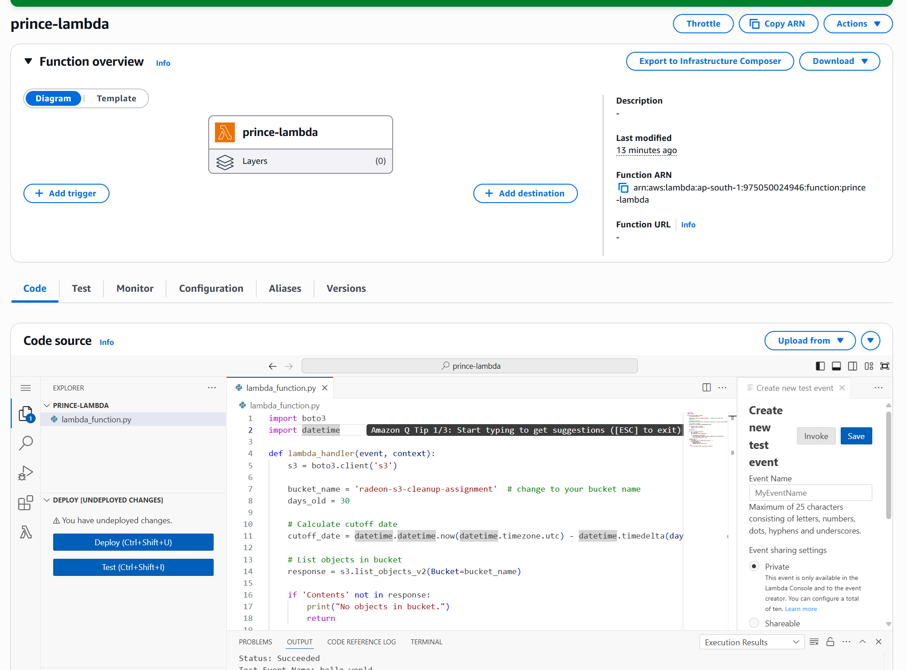

5. Lambda function:
    - Lists objects in the bucket.
    - Deletes objects older than 30 days.
    - Logs deleted object names.
   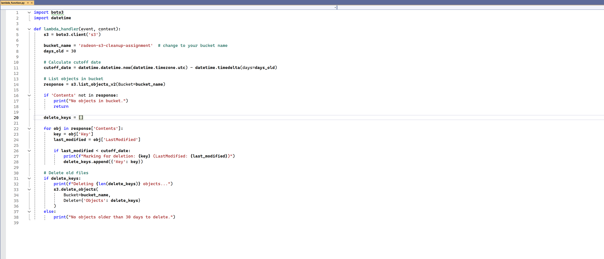

6. Tested Lambda manually.

## Screenshots

- [ ] S3 bucket and objects
- [ ] IAM Role created
- [ ] Lambda function code + test result
- [ ] S3 bucket after cleanup