# Assignment 1 - Automated EC2 Instance Management

## Objective

Automatically stop EC2 instances tagged `Auto-Stop` and start instances tagged `Auto-Start` using AWS Lambda and Boto3.

## Steps Followed

### 1️⃣ Create two EC2 instances:
 - One tagged with `Action: Auto-Start`
    

    - One tagged with `Action: Auto-Stop`
    

### 2️⃣ Create an IAM role `prince-lamda-role-task-1` with `AmazonEC2FullAccess`.
    

### 3️⃣ Create Lambda function (in this case its) `prince-lambda` with Python 3.13.
    

### 4️⃣. Lambda function uses Boto3 to:
    
    - Stop running instances tagged `Auto-Stop`.
    - Start stopped instances tagged `Auto-Start`.

   

### 5️⃣ Manually invoked the Lambda function and verified EC2 instance state changes.
   
   

______________________________________________
# Assignment 2 - Automated EC2 Instance Management

## Objective

Automatically delete files older than 30 days in a specific S3 bucket using AWS Lambda and Boto3.

## Steps Followed

### 1️⃣ Created S3 bucket `radeon-s3-cleanup-assignment`.
   

### 2️⃣ Uploaded test files (some new, some old).
   

### 3️⃣ Create an IAM role `prince-lamda-role-task-1` with `AmazonS3FullAccess`.
   

### 4️⃣ Create Lambda function (in this case its) `prince-lambda` with Python 3.13.
   

### 5️⃣ Lambda function:
    - Lists objects in the bucket.
    - Deletes objects older than 30 days.
    - Logs deleted object names.
   

### 6️⃣ Tested Lambda manually.
   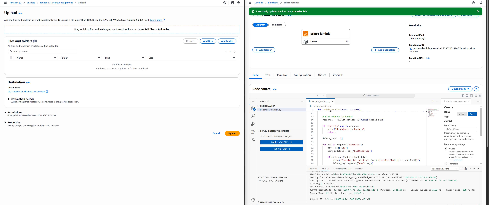

---
# Assignment 3 - Monitor Unencrypted S3 Buckets

## Objective

Automatically detect S3 buckets that do not have server-side encryption enabled, using AWS Lambda and Boto3.

## Target Buckets

For this assignment, we checked the following S3 buckets:

- `radeon-s3-cleanup-assignment`
- `radeon-s3-no-encryption`

## Steps Followed

### 1️⃣ S3 Setup

- Created 2 S3 buckets:
    - `radeon-s3-cleanup-assignment` with default settings.
    - `radeon-s3-no-encryption` intended for testing unencrypted bucket.
- **Note:** In this AWS account and region, AWS enforces default server-side encryption (SSE-S3) on all new buckets. Hence, the "Disable encryption" option was not available. This is an expected AWS behavior and was documented.
   
   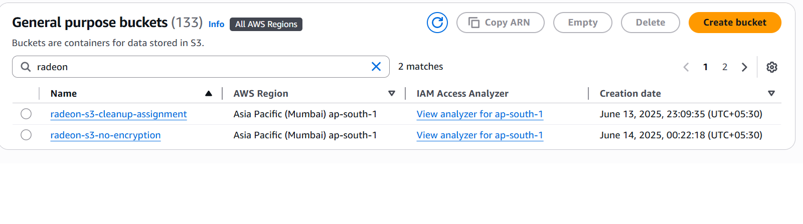

### 2️⃣ IAM Role

- Created IAM role `prince-lamda-role-task-1`.
- Attached the following policy:
    - `AmazonS3ReadOnlyAccess`

       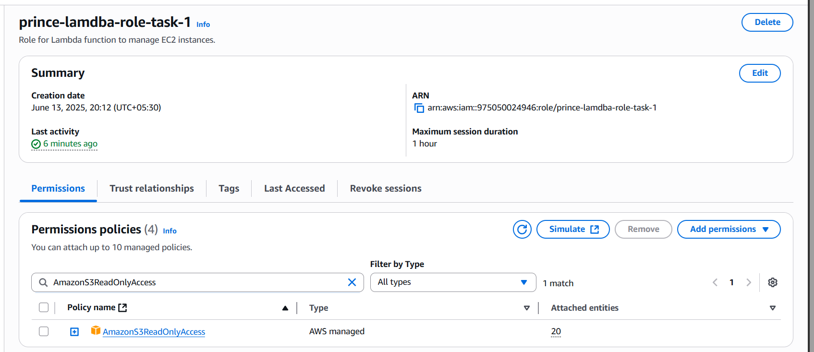

### 3️⃣ Lambda Function

- Created Lambda function: `prince-lambda`.
- Runtime: Python 3.13
- Assigned role: `prince-lamda-role-task-1`.
       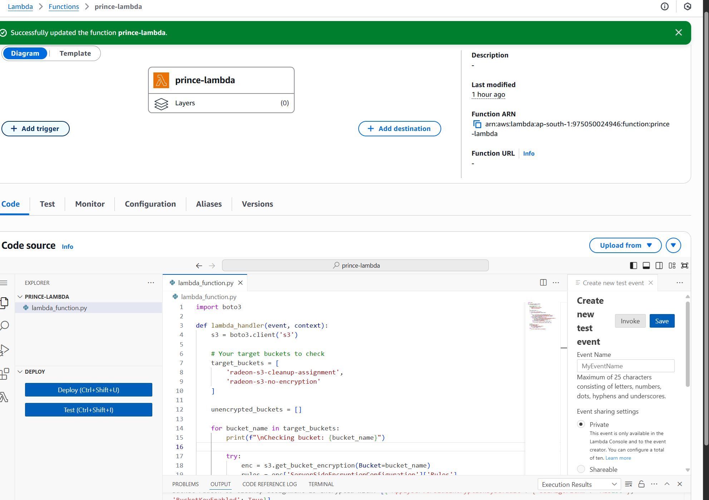

### 4️⃣ Lambda Code

- The Lambda function:
    - Lists the target buckets.
    - Calls `get_bucket_encryption` API on each bucket.
    - Detects if **Server-Side Encryption (SSE)** is configured.
    - If encryption is not found, prints: `Bucket XYZ is NOT encrypted!`.
    - Else, prints the encryption configuration.
    
        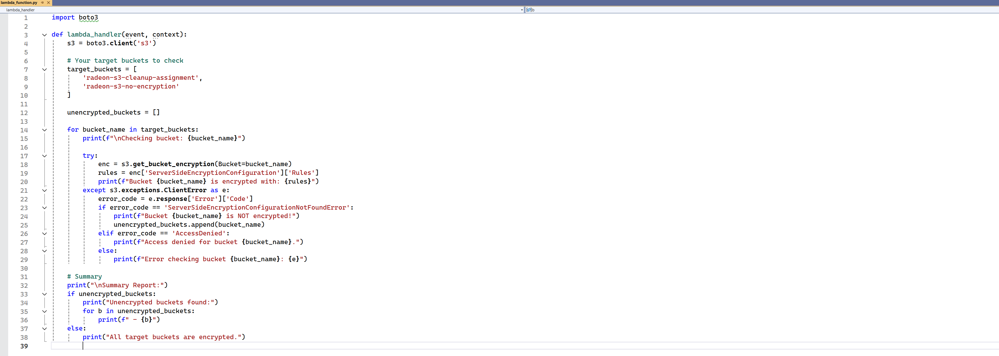

### 5️⃣ Testing

- Manually invoked the Lambda function using a test event.
- Verified Lambda logs:
    - Detected encryption status of all target buckets.
    - As expected, AWS enforced SSE-S3 on both test buckets → Lambda detected this correctly.
        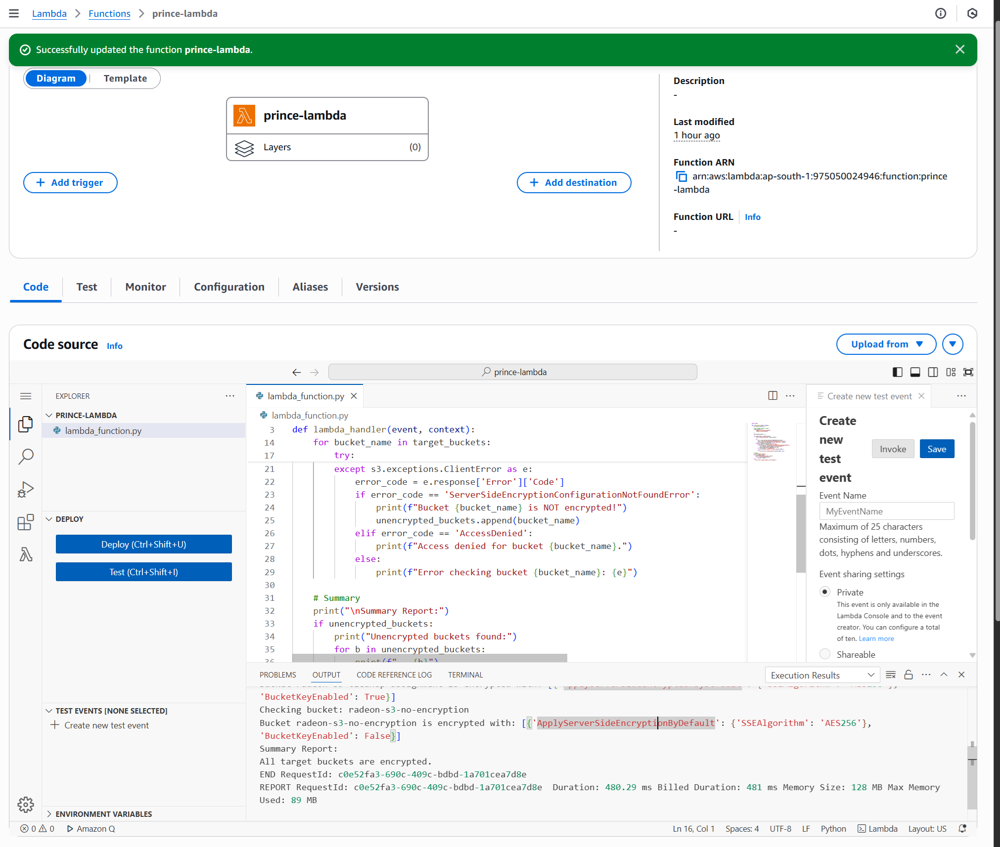

## Summary Result

- All target buckets were found to be **encrypted with SSE-S3**.
- The Lambda function logic works correctly and is ready for production.

## Notes

- AWS has started enforcing **mandatory server-side encryption** (SSE-S3) for new buckets in many regions.
- Disabling encryption is no longer supported during bucket creation in this account/region.
- Lambda function successfully detected this enforced encryption and reported correctly.

---
# Assignment 4 - Automatic EBS Snapshot and Cleanup

## Objective

Automate the backup process for an EBS volume and ensure that snapshots older than a specified retention period (30 days) are deleted to save storage costs. This is implemented using AWS Lambda and Boto3.

## Steps Followed

### 1️⃣ EBS Setup

- Created an EBS volume:
    - Volume ID: `vol-0407d37853c5a5c83` *(replace with your Volume ID)*
    - Type: gp3
    - Size: 8 GiB
- Used this volume as the target for automated snapshot and cleanup.
        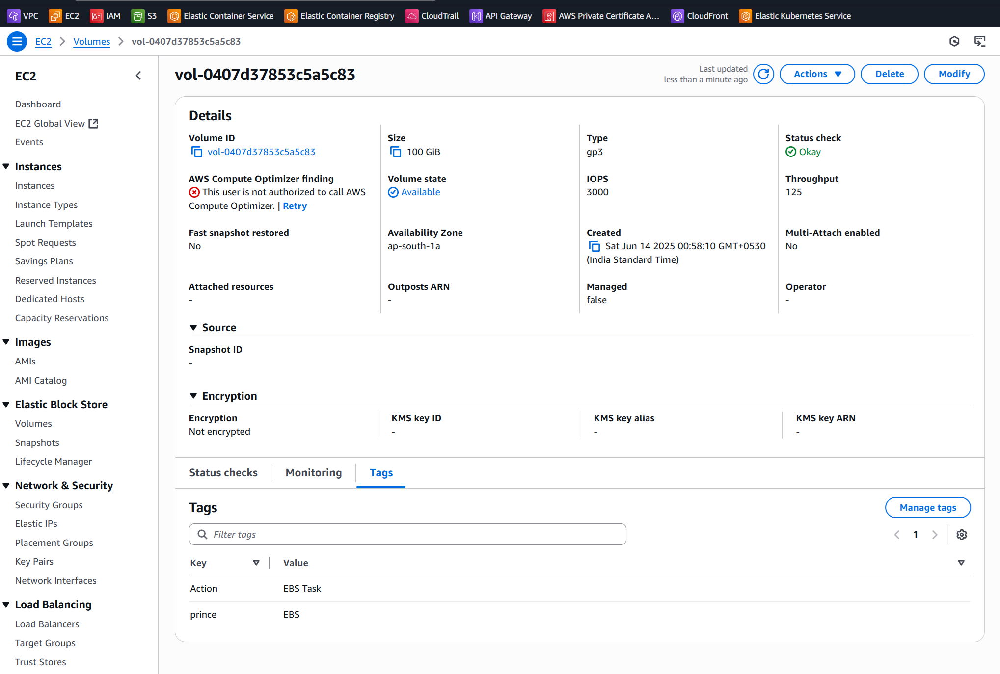

### 2️⃣ IAM Role

- Created IAM role: `prince-lamdba-role-task-1`
- Attached policy:
    - `AmazonEC2FullAccess`
- This allows Lambda to:
    - Create snapshots
    - Describe snapshots
    - Delete snapshots

        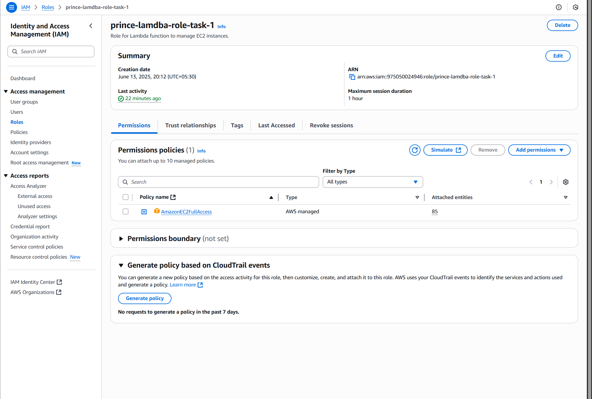

### 3️⃣ Lambda Function

- Created Lambda function: `prince-lambda`
- Runtime: Python 3.13
- Execution role: `prince-lamdba-role-task-1`
        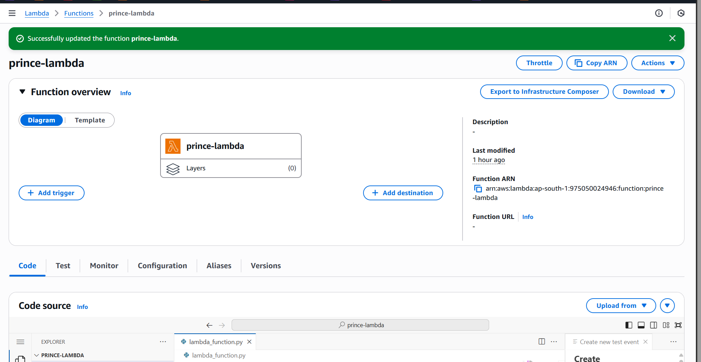

### 4️⃣ Lambda Code

- The Lambda function performs two main tasks:
    1. Creates a snapshot of the target EBS volume.
    2. Deletes snapshots older than **30 days** (based on `StartTime`).

- Additional features:
    - Tags the snapshot with `CreatedBy = Lambda-AutoSnapshot` for easier identification.
    - Filters only its own snapshots when deleting old ones.
        
        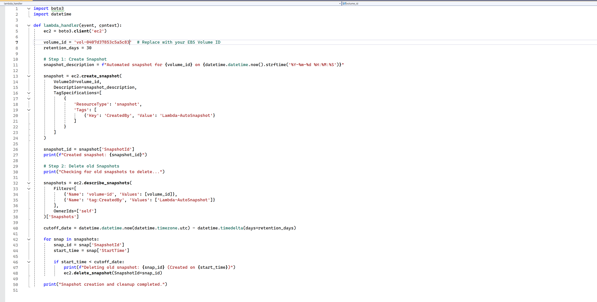

### 5️⃣ Testing

- Manually invoked the Lambda function via a test event.
- Monitored output via **Execution Results** and **CloudWatch Logs**.
- Verified in EC2 Console:
    - New snapshot was successfully created.
    - Older snapshots (if older than 30 days) were deleted automatically.
- No errors encountered.
        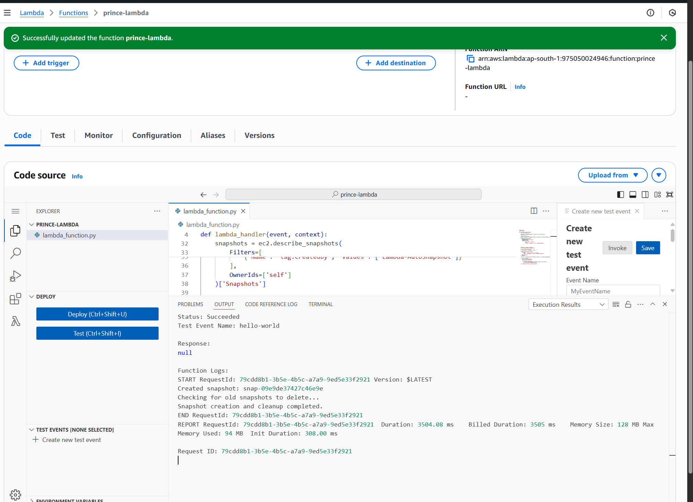

### 6️⃣ Conclusion

- The Lambda function successfully automates the EBS snapshot and cleanup process.
- This solution helps:
    - Maintain regular volume backups.
    - Save cost by cleaning up old snapshots.
    - Ensure compliance with backup retention policies.
- The function can easily be enhanced to:
    - Run on a schedule (via EventBridge).
    - Support multiple volumes.
    - Add additional snapshot tagging for compliance.

